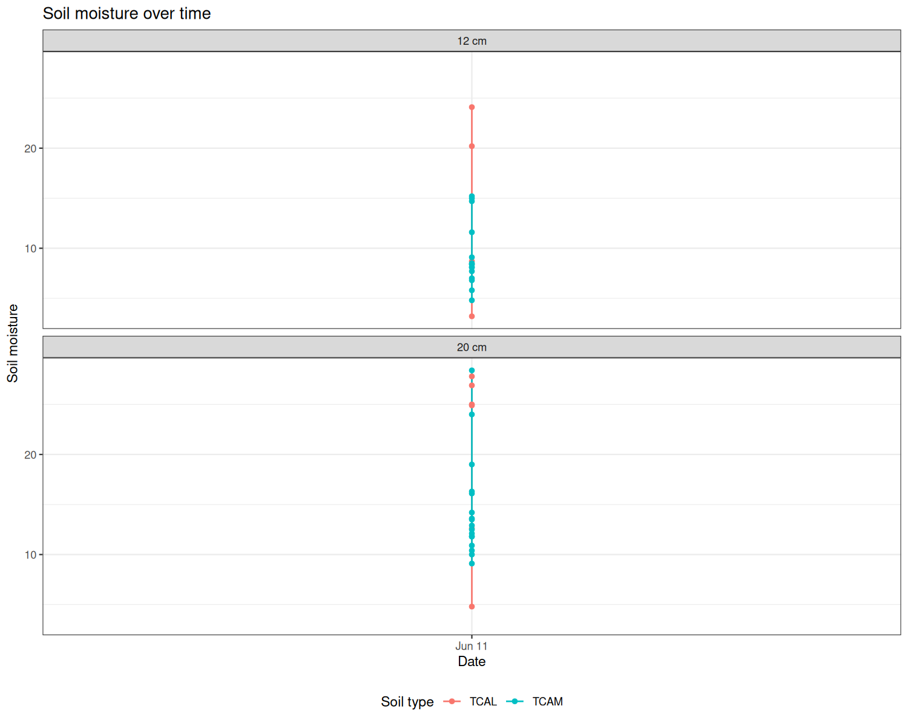

# SoilProperties

Field measurements of soil properties and plant physiological responses to induced drought conditions
at the Biosphere 2 (2026 campaign). We characterise plant responses to changing precipitation
across several soil types by measuring infiltration rates (saturated hydraulic conductivity K, derived
via Philip's two-term equation and Zhang 1997 / van Genuchten), soil moisture at 12 cm and 20 cm
depth, hyperspectral reflectance indices, and leaf-level gas exchange parameters (Jmax, Vcmax). The
goal is to resolve how specific soil physical properties constrain plant function in semi-arid
ecosystems where soil water retention is hypothesised to exert a stronger influence on gross primary
productivity than climate variables alone.

**PI:** David J.P. Moore, University of Arizona  
**Collaborators:** Angie Abarzua Munoz; Lindsey Bell

---

## Data status

<!-- Updated automatically by R/update_summary_figures.R on each push to main -->

| Data type | Last update | Row count |
|---|---|---|
| Infiltration field data | 2026-05-28 | 75 |
| Soil moisture | — | 0 |
| Hyperspectral indices | — | 0 |
| Jmax / Vcmax | — | — |

---

## Infiltration

Most recent K values (saturated hydraulic conductivity) per replicate from
`data/processed/B2_SoilInfiltration_Results.csv`:

<!-- Updated automatically by R/update_summary_figures.R on each push to main -->

| Date | SoilType | Group | K\_cm\_per\_hr | qc\_flag |
|---|---|---|---|---|
| 2026-06-08 | PSAM | 1 | 66.049 | OK |
| 2026-06-08 | THCL | 2 | 5.190 | REVIEW_high_K |
| 2026-06-11 | TCAM | 1 | NA | REVIEW_negative_C1 |
| 2026-06-11 | TCAM | 2 | 16.798 | REVIEW_high_K |
| 2026-06-11 | TCAM | 3 | 5.160 | OK |

---

## Figures

Figures are auto-generated by `R/update_summary_figures.R` and committed by CI on each data update.

### Hyperspectral indices

### Soil moisture

### Jmax and Vcmax

---

## Documentation

- [Infiltration workflow](docs/infiltration_workflow.md)

